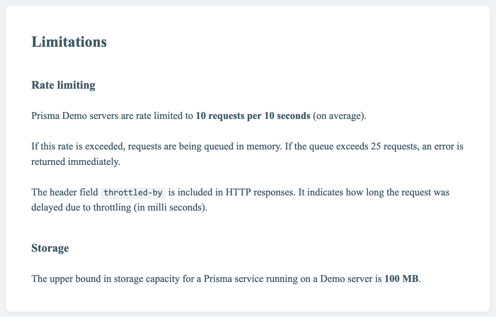
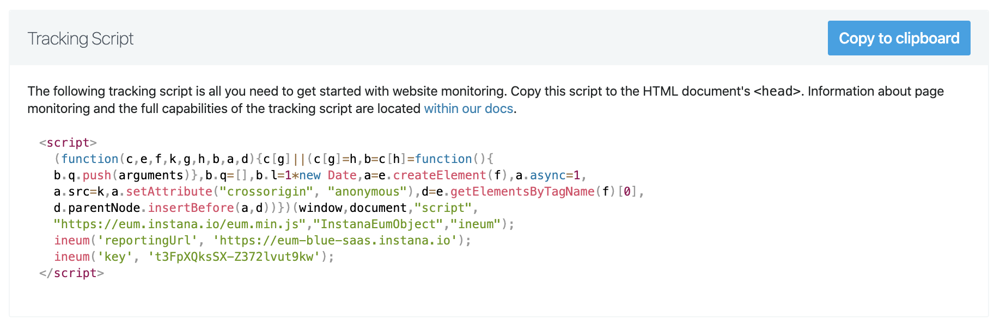
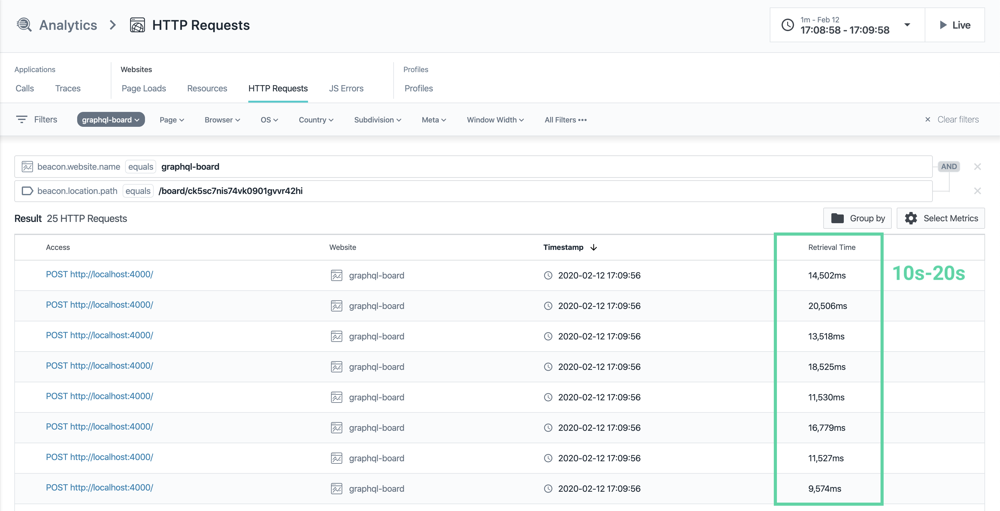
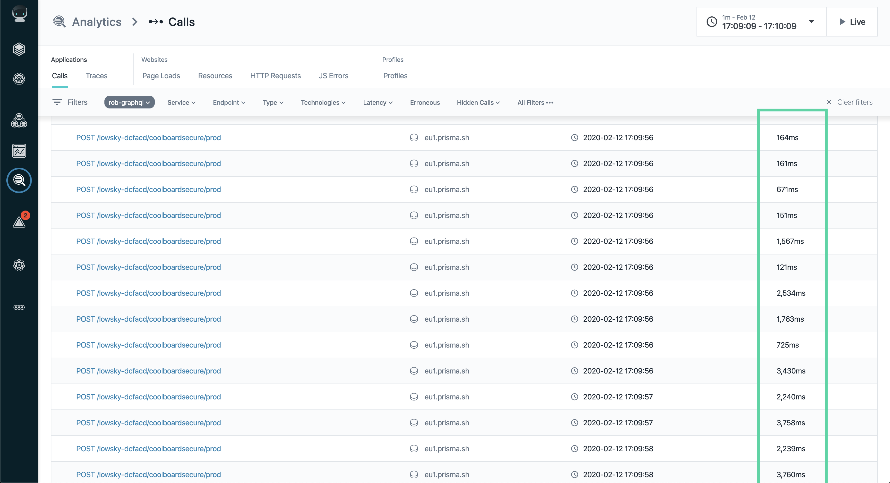
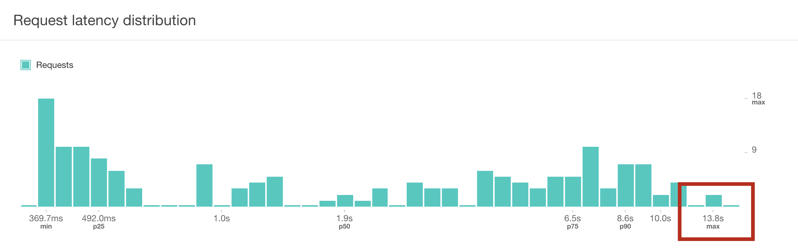

Modern IT landscapes typically consist of a bunch of different microservices. Replacing the monoliths now brings us complexity due to more parts and all their dependencies.

A key aspect for running these systems is the appropriate monitoring with the ability to handle this complexity and help to observe system performance. It also needs to understand all different communication forms like REST, gRPC, GraphQL, etc.

Additionally, this advanced tooling supports with real-time performance analysis for finding and fixing bottlenecks quickly in order to avoid bad user impressions.

In this post we will analyse the performance issues of an existing application. In a follow-up blog post we will then present the solution and the resulting performance improvement.

A demo application ([coolboard.fun](https://coolboard.fun)) for a GraphQL online course was quickly set up and running, but ran into these performance issues.

With more and more users, the performance went down faster than expected, resulting in:

*   Page load time > 1 second: even a page took up to 15 seconds!
*   Failing end-to-end browser tests after running into timeouts!

While I was developing the app, I never ran into such issues, so I started wondering

*   What was the main bottleneck? Spoiler alert: there is a subtle side effect caused by rate-limiting.
*   Is there any easy way to fix most (the typical 80%) performance issues quickly?
*   Is there at least some low-hanging fruits, just because sometimes I tend to be lazy?
*   And important in the long-term: can we get insights to make the right decision for changing architecture and building blocks later?

Before searching the root issue, we will need to understand the overall structure of the application, and the building blocks of different (micro)services, their dependencies and how they communicate.

## High-level architecture and services

Web (SPA) -> API Server(BFF, Auth) -> Prisma Server(GraphQL - ORM mapping) -> DB (relational)  

The Single-page application (SPA) is running in the browser and connects to [Auth0.com](https://auth0.com/)for authentication and accesses the API Server which provides a specific GraphQL API interface and does authentication handling (aka: backend-for-frontend). It can even be scaled up easily, because it does not do session handling there. The authentication is only done by exchanging JWT auth tokens.  
The user management and authentication is done via the separate third-party service, [Auth0.com](https://auth0.com/).

The Prisma Server is an ORM and it provides all usual CRUD operations via GraphQL operations.

## Observation

When I only open one board page with only a little number of lists of cards, then the page loads fast.

But when more pages are opened simultaneously or when there is more load, the performance drops and the page seems to be loading slow-ish!

This is what the user sees:

The first impression is the Board’s title and its lists names, which gets loaded relatively fast:

At least by loading the board’s title with its list names the user sees some quick responses.

  
Then, after some moment every list of cards gets loaded and filled with its cards. Under some load this can get catastrophical, and response times increases to more than 15 seconds!

So the user sees that the data is loaded in 2 steps:  
First, the logged-in user, then the board’s title and all titles of the lanes.  
Then it requests the data for each lane.

When you are wondering why the application reacts in this unexpected way, we need to mention that

*   developing the app happened mainly on a local dev machine within a docker environment,
*   there was neither load, nor load test, while the app was developed, so it was not noticed, and
*   finally, the deployment to a cloud service was not obviously leading to the bad performance.

Now, I have some suspicions, because I am using the free, but limited version of Prisma cloud.  
The communication between my API-gateway and the Prisma cloud server is somehow throttled and limited.

But let’s figure out how the services communicate with each other by the help of some advanced tools. Let’s see which deeper insights we get.

## Analysis - Apollo Graph Manager

The easiest way to get some metrics was by activating the built-in tracing-feature for sending query metrics in the Apollo-server: After creating an account and api-key on Apollo Graph Manager at [https://engine.apollographql.com](https://engine.apollographql.com) we can activate tracing in the API-gateway. Additionally, we just need to turn it on by wrapping the server in our API-gateway:

[carbon source-code.](https://carbon.now.sh/?bg%3Drgba(255%252C255%252C255%252C1)%26t%3Done-light%26wt%3Dnone%26l%3Djavascript%26ds%3Dtrue%26dsyoff%3D20px%26dsblur%3D68px%26wc%3Dfalse%26wa%3Dtrue%26pv%3D48px%26ph%3D32px%26ln%3Dfalse%26fl%3D1%26fm%3DHack%26fs%3D14px%26lh%3D133%2525%26si%3Dfalse%26es%3D2x%26wm%3Dfalse%26code%3Dconst%252520server%252520%25253D%252520new%252520GraphQLServer(%25257B%252520schema%252520%25257D)%25253B%25250Aconst%252520httpServer%252520%25253D%252520server.createHttpServer()%25253B%25250Aconst%252520port%252520%25253D%2525204000%25253B%25250A%25250A%25252F%25252F%252520When%252520we%252520have%252520an%252520API%252520key%252520available%25252C%252520wrap%252520it%252520into%252520apollo%252520engine%252520%25250A%25252F%25252F%252520to%252520send%252520tracing%252520metrics%252520to%252520apollo%252520graph%252520manager%25250Aif%252520(process.env.ENGINE_API_KEY)%252520%25257B%25250A%252520%252520%25250A%252520%252520%252520%252520const%252520%25257B%252520ApolloEngine%252520%25257D%252520%25253D%252520require(%2527apollo-engine%2527)%25253B%25250A%252520%252520%252520%252520const%252520engine%252520%25253D%252520new%252520ApolloEngine()%25253B%25250A%25250A%252520%252520%252520%252520engine.listen(%25257B%252520port%25252C%252520httpServer%252520%25257D)%25253B%25250A%25250A%25257D%252520%25250Aelse%252520%25257B%25250A%252520%252520%252520%252520%25252F%25252F%252520start%252520without%252520collecting%252520metrics%25250A%252520%252520%252520%252520httpServer.listen(%25257B%252520port%252520%25257D)%25253B%25250A%25257D)

Every request of data from the Prisma cloud by our API-gateway gets logged.

This will give us some insight on the communication between the website in the browser to the API-gateway. Even while the free version has timely limited logging of only the last 24 hours, it already shows us  that we run more than 200 queries, while opening the board page 29 times:  

The response-time of the CardList query is distributed between 400 milliseconds and 14 seconds! 

## Finding 1: There are too many GraphQL requests triggered

In order to understand which queries are slow or where the bottleneck is, we will need to dive deeper and inspect the communication between the API-gateway and Prisma cloud server.  

One root cause may be the limitation or throttling of our free GraphCool/Prisma cloud server:

Our web client automatically handles it with running retry-after-failure cycles, but we definitely run into these limitations!

Until now, we only get the metrics for request which were sent to the API-gateway.

Let’s figure out how the API-gateway and the Prisma cloud server communicate.

## Instana™️ Analysis

For further analysis we will use the InstanaTM APM monitoring tool which allows us to get full tracing metrics of all requests from the browser down to the database.

Instana™️ is a modern APM-tool which can be used as a Saas or on-prem version.  
Instana™️ also provides end-user-monitoring (EUM) together with tracing the communication of microservices and down to database operations.

Here, we will use the Instana™️ SaaS version and just need to start an agent in our local Docker environment which sends the recorded monitoring data to the Instana™️ backend.

### Local Setup

To use Instana™️, I just add end-user-monitoring and start tracing API-gateway (more later)

Compared to the production environment we will get different timings, but that’s okay, as we just want to focus on the communication flow for now.

To enable the end-user-monitoring we will need to create a website in Instana™️, and add this snippet into webpage, similar to e.g. embedding Google Analytics library

Everything will work automatically out of the box, we just need to add extra steps for e.g. setting the name of the page, via

`ineum('page', 'main-page')`

To get full, automatic code injection in order to get full tracing and monitoring in the Node.js based API-gateway, we just need to run these lines before anything else. This way, all requests and responses get traced automatically!

### The setup and high-level architecture for our further analysis:

Let’s start from the user perspective:

Instana™️ provides a “website view” where we can see how our boards page with all its resources gets loaded. After filtering for XHR / Post requests, we already see the necessary requests for boards data:

1.  One request, getting board’s name and its lanes’ titles only
2.  Some extra request for each lane (=card list)

Although this looks pretty fine (load time below 1 second), the performance gets worse when more users load the board page. We can see that after clicking that button to open the Analytics page to show the backend traces.  

We can see all specific XHR requests to the API-gateway (at localhost:4000) with the different, varying response times (in the last column):

We need to dive deeper into one of these traces to figure out how it communicates to the Prisma cloud backend.  
First, when filtering for all calls, we can see that varying response times in the right column again.

That already gives some indication for our issues!

Let’s see what happens in the background by selecting one call. This gives some information and deeper insights into the communication of API-gateway and the Prisma cloud backend:  

### Traces for the browser requesting the initial board metadata:

We find 2 sequential requests to the Prisma backend, called by the API-gateway one after the another:

1.  First, it is requesting some user information.
2.  In the second request it retrieves the board data from the backend. (In the image above it is selected, so we see the query details on the right side)

### Traces for the browser requesting one lane (=card list) with its cards:

Here, we also find an extra request - for some user data - (see the details on the right side)!

Finally, even while there are only 6 GraphQL requests by the frontend, we will end up in more than 12 backend calls to Prisma backend!

## Finding 2: There are unneeded extra requests by the API-gateway

In the analysis above, we found that the API-gateway is requesting some unneeded and unexpected extra user data from the database backend (at eu1.prisma.sh), doubling the number of requests.

Quickly running into the rate-limiting causes the varying latency with a maximum response-times of up to 14 seconds as Instana™️ shows us here:

  

## How can we solve this?

We quickly found a performance bottleneck and what is causing that problem: The main goal will be to reduce the overall number of GraphQL requests at the backend.

Obviously, even while the architecture and service structure were fully sufficient for a little demo, the best solution will be to migrate to a less limited GraphQL persistence service (e.g. FaunaDB) or hosting a Prisma backend service on our own.

To fix the performance issues, we could even add caching in the API-gateway or collapse all GraphQL queries into one huge GraphQL query, but this means adapting the application.  
Low-hanging fruits: As a quick measure we should get rid of fetching extra user information in each request by adapting our API-gateway server!

## Summary

In order to be able to find performance issues it is necessary to have the right tools to not only monitor performance but also to analyse it easily and find problems quickly.  
The Apollo Engine helped to get some quick statistics first, but will be limited to GraphQL specific operations only.  
With Instana™️ we additionally get the detailed bigger picture and can also find the bottleneck in the communication patterns of the the whole system.

We used Instana™️ for the detection of the performance issues with only a limited view of only a part of the system.  
You can imagine how effective this could be when it is used within the production system, monitoring all parts of the whole system, and when you also can use its advanced alerting features!  

When you are interested in more details and even want to try Instana™️, you can run a full-featured, 14-days trial version: [Instana™️ Trial](https://www.instana.com/trial/?last_program_channel=Partner&last_program=codecentric&utm_source=codecentric&utm_medium=Website&utm_campaign=Partner_Promotions)  
You could also request a demo or run a PoC together the [APM team](https://www.codecentric.de/leistungen/it-acceleration/) (German)

There is also this post about how to install [instana on a kubernetes cluster](https://blog.codecentric.de/2019/10/kubernetes-monitoring-mit-instana-teil-1/). (German)  

As we now have an idea what the root problem is, we can improve the performance by up to 50% with only little effort. This will be presented in a follow-up blog post.
